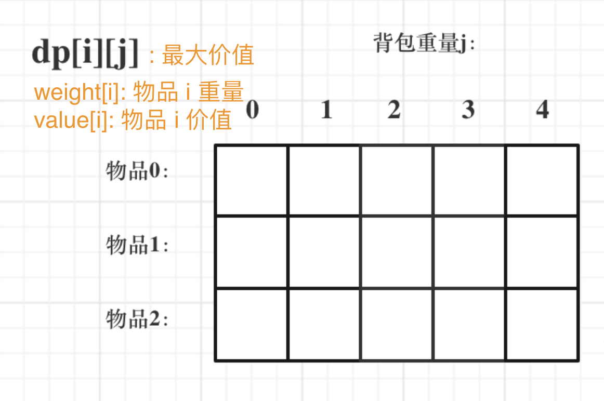

### 题目

有n件物品和一个最多能背重量为w 的背包。第i件物品的重量是weight[i]，得到的价值是value[i] 。**每件物品只能用一次**，求解将哪些物品装入背包里物品价值总和最大。

背包容量 = 4

|       | weight | value |
| ----- | ------ | ----- |
| 物品1 | 1      | 15    |
| 物品2 | 2      | 20    |
| 物品3 | 4      | 30    |

### 思路

#### 概念
n 件物品编号：1,2,...n

对应重量：w[i]

对应价值：v[i]

背包容量：b

变化的因素有 2 个：物品、背包容量，即自变量有 2 个，因此想到二维数组每个维度代表一个自变量，因变量即数组的值。此外，还有两个已知的一维数组 w[i]、v[i] 用作逻辑里判断使用，但请不要将其和自变量混淆。

如果直接用 dp\[n][j] 从所有物品取，只长容量，可以简化为一维数组 dp[j]。dp[1] -- 背包容量为 1 从 n 件物品中取，遍历每件物品选择放或不放，但这样没办法利用 dp[j-1] 简化计算。

现在来看正确 dp\[i][j]，背包容量为 j 从前 i 件物品中取。dp\[i][j] = Max(dp\[i - 1][j] ,  v[i] + dp\[i - 1][j - w[i]])，同时用到了 i-1 和 j-w[i]，即用到了 dp 小值，可以左脚踩右脚上天了。

#### 递归五部曲

1. dp\[i][j] 数组下标及其含义：背包容量是 j，从前 i 件物品中任取，最大价值；

   | 物品/背包容量 | 容量0 | 容量1 | 容量2 | 容量3 | 容量4 |
   | :-----------: | ----- | ----- | ----- | ----- | ----- |
   |    无物品0    |       |       |       |       |       |
   |     物品1     |       |       |       |       |       |
   |     物品2     |       |       |       |       |       |
   |     物品3     |       |       |       |       |       |

2. 递归表达式: dp\[i][j] = Max(dp\[i-1][j] , dp\[i-1][j-w[i]] + v[i])

3. dp数组初始化：
   | 物品/背包容量 | 容量0 | 容量1 | 容量2 | 容量3 | 容量4 |
   | :-----------: | ----- | ----- | ----- | ----- | ----- |
   |    无物品0    | 0     | 0     | 0     | 0     | 0     |
   |     物品1     | 0     |       |       |       |       |
   |     物品2     | 0     |       |       |       |       |
   |     物品3     | 0     |       |       |       |       |

4. 遍历顺序: 从上至下，从左至右。因为递归公式中用到了上一行中正上方（dp\[i-1][j]）和左上方（dp\[i-1][j-w[i]]）数据，因此遍历顺序需是【由上至下，由左至右】。但是先由上至下还是先由左至右，这个可以调换（还是从递归公式中可以看出）。

   1. 由上至下，由左至右：先固定背包容量，再逐个将物品纳入进来，符合人类思维习惯，好。
   2. 由左至右，由上至下：先固定物品个数，再内层循环逐步增加容量。

5. 举例推导 dp 数组

   **dp\[1][1]**: 背包容量 1，从物品 1 中取，最大价值自然是 v[1] 即 15，也可从递归公式直接计算：

   若不放物品1: dp\[0][1] = 0

   若放物品1:  v[1] + dp\[0][1 - w[1]] = 15

   因此，dp\[1][1] = Max (dp\[0][1], dp\[0][1 - w[1]] + v[1]) = **15**。

   **dp\[2][1]**: 背包容量 1，从前两个物品中取，由于 w[2] = 3 > 背包容量，所以一定不取物品 2，所以最大价值还是 15，也可由递归公式计算：

   b - w[2] < 0 ，所以没有放物品 2 的可能，直接 dp\[2][1] = dp\[1][1] = **15**。

   **dp\[3][1]**，同理也是 **15**。

   **dp\[1][2]**：背包容量 2，从前一个物品中取，w[1] < 2，最大价值自然是 15，也可由递归公式计算：

   若不放物品 1: dp\[0][2] = 0;

   若放物品 1: v[1] + dp\[0][2 - w[1]] = v[1] + dp\[0][1] = **15**

   **dp\[2][2]**: 背包容量 2，从前两个物品中取，2（物品2重量）= 2（背包容量），因此能取物品2，人类思维自然想到最大价值为 15，也可由递归公式计算得到：

   若不放物品 2：dp\[1][2] = 15;

   若放物品 2：v[2] + dp\[1][2 - w[2]] = v[2] + dp\[1][0] = 20

   因此，dp\[2][2] = **20**。

   **dp\[3][2]**：背包容量 2，从前三个物品中取，w[3] > b，因此 3 一定放不进去，所以 dp\[3][2] = dp\[2][2] = **20**。

   **dp\[1][3]**: 背包容量 3，从前一个物品取，b > w[1]，所以放 1 就完了，即 dp\[1][3] = 15。从递归公式计算：

   若不放物品 1: dp\[0][3] = 0;

   若放物品 1: v[1] + dp\[0][3 - w[1]] = v[1] + dp\[0][2] = 15;

   因此，dp\[1][3] = **15**。

   **dp\[2][3]**：背包容量 3，从前两个物品取，b >= w[2] = 3。

   若不放物品 2: dp\[1][3] = 15;

   若放 物品 2: v[2] + dp\[1][3 - w[2]] = v[2] + dp\[1][1] = 35;

   因此，dp\[2][3] = **20**。

   **dp\[3][3]**：背包容量 3，从前三个物品取，b < w[3] ，物 3 放不进去，所以 dp\[3][3] = dp\[2][3] = 35

   **dp\[1][4]**：背包容量 4，从前一个物品中取，b > w[1]，自然思维得到 15；也可由递归公式计算：

   若不放物品 1: dp\[0][4] = 0;

   若放物品 1: v[1] + dp\[0][j - w[1]] = v[1] + dp\[0][3] = 15;

   因此，dp\[0][4] = **15**；

   **dp\[2][4]**: 背包容量 4，从前两个物品取，b > w[2]，

   若不放物品 2: dp\[1][4] = 15;

   若放物品 2: v[2] + dp\[1][4 - w[2]] = v[2] + dp\[1][2] = 35;

   因此，dp\[2][4] = **35**；

   **dp\[3][4]**：背包容量 4，从前三个物品取，b >= w[3]，

   若不放物品 3：dp\[2][4] = 35;

   若放物品 3: v[3] + dp\[2][4 - w[3]] = v[3] + dp\[2][0] = 30;

   因此，dp\[3][4] = **35**；

   |       | weight | value |
   | ----- | ------ | ----- |
   | 物品1 | 1      | 15    |
   | 物品2 | 2      | 20    |
   | 物品3 | 4      | 30    |

   | 物品/背包容量 | 容量0 | 容量1 | 容量2 | 容量3 | 容量4 |
   | :-----------: | ----- | ----- | ----- | ----- | ----- |
   |    无物品0    | 0     | 0     | 0     | 0     | 0     |
   |     物品1     | 0     | 15    | 15    | 15    | 15    |
   |     物品2     | 0     | 15    | 20    | 35    | 35    |
   |     物品3     | 0     | 15    | 20    | 35    | 35    |

### Key

二维数组这个数据结构比较难想 dp\[i][j]（dp 数组下标及其含义）。

i：前 i 件物品中取

j：背包容量为 j

值：最大价值

这三个维度




### Code

```java
public int bag01TwoDiBagFirst (int[] w, int[] v, int bagSize) {
        int goodsCount = w.length - 1;
        int[][] dp = new int[goodsCount + 1][bagSize + 1];// 自带初始化第一行、第一列为 0；
        for (int b = 1; b <= bagSize; b++) {
            for (int i = 1; i <= goodsCount; i++) {
                if (b - w[i] < 0) {
                    dp[i][b] = dp[i - 1][b];
                } else {
                    int notPutI = dp[i - 1][b];
                    int putI = v[i] + dp[i - 1][b - w[i]];
                    dp[i][b] = Math.max(notPutI, putI);
                }
            }
        }
        System.out.println(Arrays.deepToString(dp).replace("], ", "]\n"));
        return dp[goodsCount][bagSize];
    }
```


